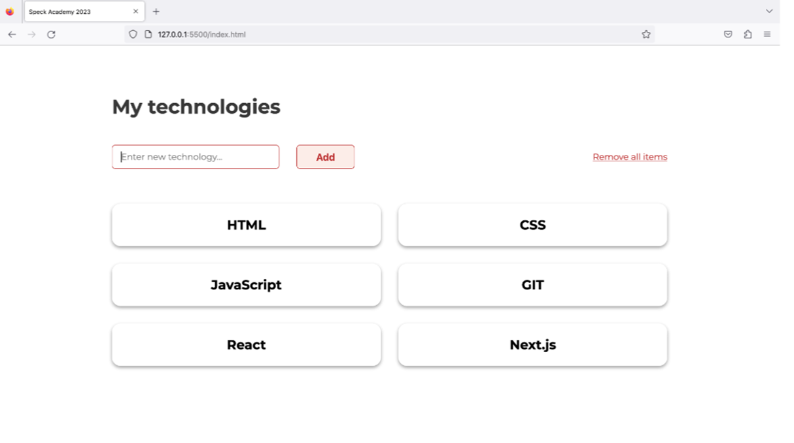

# SpeckEntranceTask
Entrance task for SPECK Academy 2023 - a web page to add and remove items using only HTML, CSS and JS.

## Task

The application has to be as similar as possible to the one shown below:

Specifications of the application:

- The application must have the ability to input arbitrary values via input fields.
- Upon clicking the "Add" button, using JavaScript, it is necessary to retrieve the entered value from the input field and display it on the page in a grid as seen in the proposed solution or in any other similar way.
- The application must have a "Remove all items" element, upon clicking which all elements containing the entered values are removed from the application/page.

Note: WordPress, Wix, and other programs where you build a website/application with mouse clicks are not allowed.

Criteria:

- Only HTML and CSS, in other words, the visual representation of the application without additional functionality.
- Use of JavaScript to demonstrate that you can retrieve the entered value via JavaScript when clicking the "Add" button.
- Creating an HTML element through JavaScript and assigning the entered value from the input field to the innerText of the newly created HTML element. Adding the newly created element with innerText to the user interface of the webpage/application using the JavaScript appendChild method.
- Clicking on "Remove all items" should remove all entered elements from the HTML DOM.
